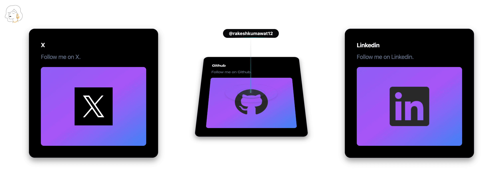
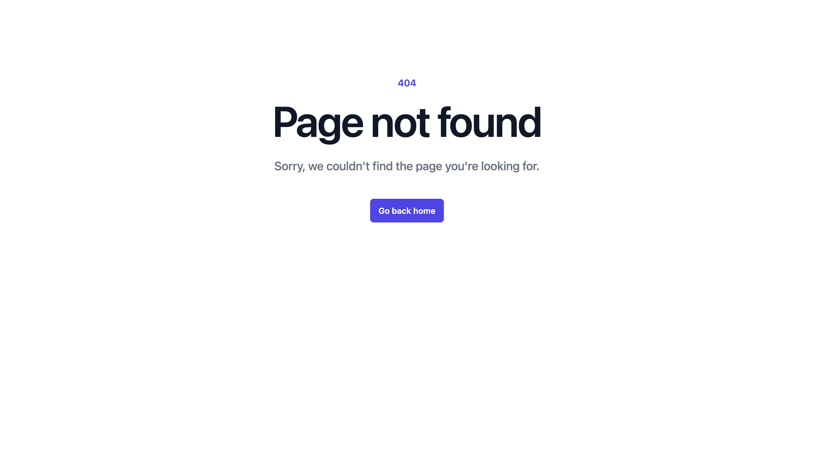

# **Necklace Paradise - A Stunning E-commerce Platform for Jewelry Enthusiasts**

Welcome to Necklace Paradise, a premium online store designed exclusively for jewelry lovers. Built using the MERN stack.

## **Table of Contents**

1. [Overview](#overview)
2. [Features](#features)
3. [Tech Stack](#tech-stack)
4. [Backend Details](#backend-details)
5. [Frontend Details](#frontend-details)
6. [Payment Integration with Stripe](#payment-integration-with-stripe)
7. [Getting Started](#getting-started)
8. [Screenshots](#screenshots)
9. [Contributing](#contributing)
10. [Contact](#contact)

## **Overview**

This modern e-commerce application combines elegant aesthetics with cutting-edge technology. Whether you're looking for a statement piece or a subtle accessory, Necklace Paradise delivers a seamless shopping experience.

From secure authentication to effortless checkout, every feature has been carefully crafted to ensure reliability, scalability, and user satisfaction.

**Live Demo:** https://necklaceparadise.vercel.app/ 

## **Features:**

### **User Experience**
- Authentication & Authorization: Secure user sign-up, login, and management with JWT (JSON Web Token) for token-based authorization.
- Responsive Design: Fully optimized for desktop, tablet, and mobile devices, ensuring a smooth browsing experience on any screen size.

### **Admin Capabilities (Admin Panel)**
- Manage products: Add, update, and remove items.
- Oversee orders: View, process, and track orders with ease.
- Organize categories: Maintain a structured and intuitive product catalog.

### **Shopping Features**
- Add to Cart: Effortlessly add items to the cart with dynamic updates.
- Checkout with Payment Integration: Secure and hassle-free payments powered by Stripe, ensuring safe transactions for all customers.

### **Security & Performance**
- Secure API Endpoints: Robust backend powered by token-based authorization to protect user data and maintain system integrity.
- High Performance: Built on the MERN stack with efficient data handling and fast rendering using React.

## **Tech Stack**

| **Component**      | **Technology**          |
|---------------------|-------------------------|
| Frontend           | React, Tailwind CSS, Redux, Vite      |
| Backend            | Node.js, Express        |
| Database           | MongoDB, Mongoose       |
| Authentication     | JWT, Bcrypt   |
| Payment Gateway    | Stripe                   |
| Deployment         | Vercel (Frontend), Render (Backend) |

## **Backend Details**

The backend of Necklace Paradise is powered by **Node.js** and **Express.js**, delivering a fast, reliable, and scalable API to support the application. With a focus on security and performance, the backend ensures seamless integration and data management.

### **Key Features**

- **RESTful API Endpoints:** Perform CRUD operations effortlessly for products, orders, and categories.
- **Secure Authentication:** Powered by JWT (JSON Web Token), ensuring robust user authentication and role-based access control.
- **Scalable Database:** Built on MongoDB, providing efficient, flexible, and reliable data storage to handle growing business needs.

This backend architecture ensures that Necklace Paradise operates smoothly and securely, meeting the demands of a modern e-commerce platform.

### **Environment Variables**
Add a `.env` file with the following variables:
```env
port=
mongo_db_url=
jwt_secret_salt=
stripe_secret_key=
stripe_public_key=
```

## **Frontend Details**

The frontend of Necklace Paradise is a cutting-edge implementation designed for speed, scalability, and an exceptional user experience. Built with React.js and Redux, and powered by Vite, it ensures lightning-fast development and build times.

Key Features
- **Dynamic User Interface:**
Effortlessly browse products, manage your cart, and complete checkouts with a seamless, intuitive UI.
- **Efficient State Management:**
Leveraging Redux to handle user sessions state with ease and reliability.
- **Modern Responsive Design:**
A beautifully crafted layout, styled using the Tailwind CSS framework, adapts flawlessly to desktop, tablet, and mobile devices for an optimal user experience.

Necklace Paradise blends elegance with performance, offering users a visually stunning and highly functional shopping platform.

## **Payment Integration with Stripe**
Stripe Payment Integration

This application integrates with the Stripe Payment Gateway to handle secure and seamless transactions.

### **Steps to Configure Stripe**
1.	Create a Stripe account at Stripe.
2.	Obtain your Publishable Key and Secret Key from the Stripe dashboard.
3.	Add these keys to the environment variables:
- Backend: stripe_secret_key
- Frontend: stripe_public_key

Testing Card Details
- Card number: 4000003560000008
- Expiration date: 12/26
- Security code: 111

### **Payment Flow**

1.	**Checkout Initialization:**
The user proceeds to checkout after finalizing their order.
2.	**Request Payment:**
The frontend sends a payment request to the backend.
3.	**Generate Payment Intent:**
The backend uses Stripe’s API to create a secure payment intent.
4.	**Payment Processing:**
Stripe securely processes the payment details provided by the user.
5.	**Notification and Order Update:**
    - The user receives confirmation of payment success or failure.
    - Order details are updated in the MongoDB database accordingly.

This implementation ensures secure payment handling, improving user trust and transaction reliability.

## **Getting Started**
Prerequisites
- Node.js (>= 14.x)
- MongoDB (local or cloud)
- Stripe Account

1.  Clone the repository:

    ```bash
    git clone https://github.com/rakeshkumawat12/necklaceparadise
    cd necklaceparadise
    ```

2.  Install dependencies:

    ```
    # Install server dependencies
    cd backend
    npm install

    # Install client dependencies
    cd ../frontend
    npm install
    ```

3.  Set up environment variables as mentioned above.

4.  Run the application:
    ```bash
    # Start the backend server
    cd backend
    npm start

    # Start the frontend server
    cd ../frontend
    npm run dev
    ```

5.	Open the app in your browser at http://localhost:5173/ 

## **Screenshots**
| **Feature**         | **Desktop**                                                      | **Mobile**                                      |
| ------------------- | ---------------------------------------------------------------- | ----------------------------------------------- |
| **Register**        |                   |  |
| **Login**           |                 |  |
| **Home**            |                   |  |
| **Product List**    |  |  |
| **Product**         |                   |  |
| **About Me**        |                   |  |
| **Page Not Found**  |                   |  |
| **My Order**        |                   |  |
| **Cart & Checkout** |                   |  |
| **Admin Dashboard** |  <br>   <br>                 |   <br>  <br> |
| **User Profile**    |                   |  |


## **Contributing**
Let others know how they can contribute:
1.	Fork the repository
2.	Create a new branch: git checkout -b [feature-branch]
3.	Commit changes: git commit -m ['Add new feature']
4.	Push to the branch: git push origin [feature-branch]
5.	Open a pull request

## Contact

- Author: Rakesh Kumawat
- Email: rakeshkumawatrrkk12877@gmail.com
- LinkedIn: https://www.linkedin.com/in/kumawatrakesh/
- Twitter: https://x.com/RakeshKumawattt